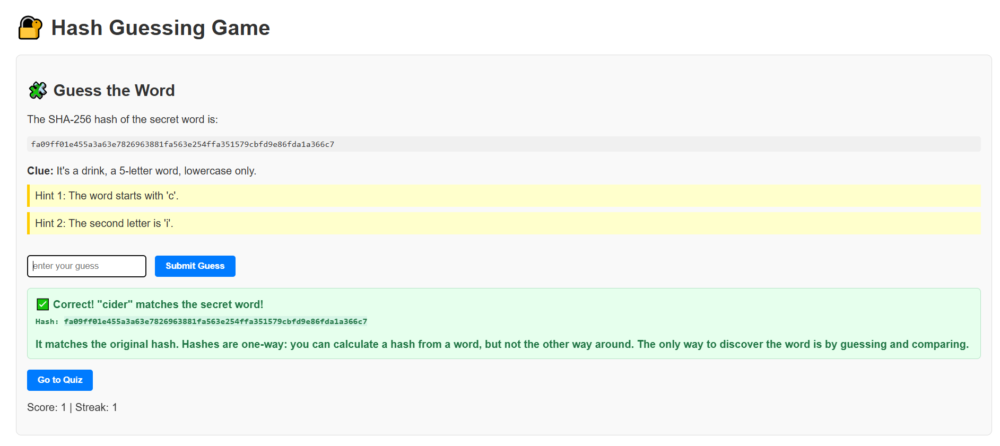

# 🔐 Hash Guessing Game

A fun and educational browser game that teaches players the basics of cryptographic hashing through interactive challenges.

## 🎯 How It Works
- Start with a crash course on what a hash is and how it works
- View the SHA-256 hash of a secret word
- Use clues to guess the original word
- Learn how small changes produce drastically different hashes
- Finish with a quick multiple-choice quiz to test your understanding

## 💻 Built With
- HTML
- CSS
- JavaScript (uses Web Crypto API for SHA-256 hashing)

## 🚀 How to Play
1. Clone or download this repository
2. Open `index.html` in your browser
3. Follow the instructions and start guessing!

You can also host it live using GitHub Pages, Netlify, or any static site host.

## 📸 Preview
 <!-- Add a screenshot file if you like -->

## 🌐 Live Demo
[🔗 Click here to play the game](https://sigillu.github.io/hash-guessing-game/)

## 📄 License
This project is licensed under the **MIT License** — meaning:

- ✅ You’re free to use, share, and modify the code
- ✅ You can use it in personal or commercial projects
- ⚠️ Just keep my name in the license as the original creator

See the [LICENSE](LICENSE) file for details.

---

Made with 🧠 and ☕ to help people learn one hash at a time!
